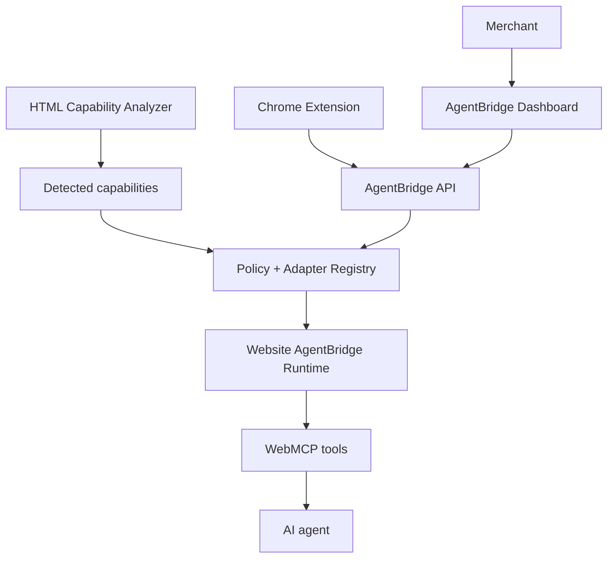

# AgentBridge

## Make your website ready for AI agents.

AgentBridge helps existing websites expose approved capabilities to AI agents through WebMCP, with website ownership verification, capability detection, adapters, merchant permissions, customer confirmation, activity logging, and a master kill switch.

## Problem and solution

AI agents need structured, reliable website capabilities—not fragile button-clicking. AgentBridge lets merchants verify a website, inspect deterministic HTML signals, configure a known adapter, approve individual tools, and control access from one policy layer. Website runtimes remain responsible for real WebMCP registration.

## Why WebMCP

WebMCP lets a website describe explicit tools with schemas instead of asking an agent to guess a UI. AgentBridge adds the merchant control plane: detected does not mean executable, and execution does not mean permanently available.

## Architecture



## Features

- Ownership verification and deterministic HTML-only capability analysis.
- Known adapters for the store, restaurant data, service data, and local quote confirmation.
- Tool-by-tool approval plus a persistent master Agent Access kill switch.
- Page-local customer confirmation for consequential actions.
- Non-sensitive activity logs and actual runtime/debug status.
- Chrome extension as a merchant control surface, not a second policy system.

## Demo businesses

| Website | Approved WebMCP tools |
| --- | --- |
| Northstar store | `search_products`, `get_product`, `check_inventory`, `add_to_cart` |
| Olive & Ember restaurant | `get_menu`, `get_opening_hours` |
| Clearline Studio | `get_services`, `request_quote` |

## Human + AI safety model

1. AgentBridge detects capability signals; it does not turn arbitrary HTML into actions.
2. A known adapter and valid configuration are required before a tool can be active.
3. Merchant approval and Agent Access must both be on.
4. Consequential fixture actions show a visible customer confirmation before local state changes.
5. Turning Agent Access off causes the page runtime to remove active tools.

## Local setup

```powershell
npm start
```

Open:

- Merchant app: `http://localhost:3000/`
- Store: `http://localhost:3000/store/`
- Restaurant: `http://localhost:3000/restaurant/`
- Services: `http://localhost:3000/services/`

Register a site, copy the generated verification tag into its page, verify it, analyze, configure adapters where requested, approve tools, and enable Agent Access. Use `npm run demo:reset` only for local demo resets.

Environment variables are documented in [.env.example](.env.example). Local development keeps JSON persistence through `AGENTBRIDGE_DATA_DIR`.

## Chrome extension

Load [extension](extension) as an unpacked extension from `chrome://extensions`. It works against localhost by default. For a public deployment, set the exact HTTPS API origin in `extension/config.js`, reload the extension, and grant that one optional host permission when prompted.

## WebMCP testing

Use a Chrome profile with `chrome://flags/#enable-webmcp-testing` enabled for local development, or enroll an HTTPS deployment in Chrome’s WebMCP origin trial. AgentBridge uses `document.modelContext.registerTool` in the page context and reports unsupported runtimes honestly. See [WEBMCP-TEST.md](WEBMCP-TEST.md) for completed evidence and the deferred Chrome lifecycle proof.

## Deployment

Railway is the recommended competition deployment: [railway.json](railway.json) deploys one Node service, runs `npm run check` during build, starts with `npm start`, and checks `/` for health. The server binds to `0.0.0.0` and honors Railway’s injected `PORT`.

After Railway creates an HTTPS public domain, set these service variables and redeploy:

- `PUBLIC_BASE_URL=https://your-railway-domain`
- `API_BASE_URL=https://your-railway-domain`
- `CORS_ORIGINS=https://your-railway-domain`
- `AUTO_SEED_DEMO=true`
- `DEMO_RESET_ENABLED=false`

Railway’s service filesystem is ephemeral. On a clean startup, `AUTO_SEED_DEMO=true` deterministically creates the three verified, configured demo sites only when `PUBLIC_BASE_URL` is set and no JSON state exists. This prevents seed records from ever pointing to `localhost`; it also never overwrites state already present in the running environment. The included [render.yaml](render.yaml) remains a reference configuration, but Railway is the recommended path. A production version should use durable storage. If an origin-trial token is issued, set `WEBMCP_ORIGIN_TRIAL_TOKEN`; it is rendered into demo pages without committing a token.

## Competition demo in 30 seconds

1. Register and verify a site.
2. Analyze its detected capabilities.
3. Configure adapters and approve tools.
4. Turn on Agent Access—the site is Agent Ready.
5. An AI agent calls real approved WebMCP tools.
6. The customer confirms consequential actions locally.
7. Turn Agent Access off and the website runtime removes the tools.

## Known limitations

- This MVP uses JSON persistence. Railway (and the Render reference configuration) can reset state after redeploy/restart; the competition seed restores a clean deterministic demo state, while production should use durable persistence.
- Public reset is disabled by default.
- Arbitrary website detection is never treated as an executable integration.
- Complete Chrome page-level ON/OFF lifecycle proof remains pending the documented local flag/origin-trial environment; in-app-browser read-tool evidence is recorded separately.

For the full recording checklist, see [DEMO.md](DEMO.md) and [SUBMISSION-READY.md](SUBMISSION-READY.md).
